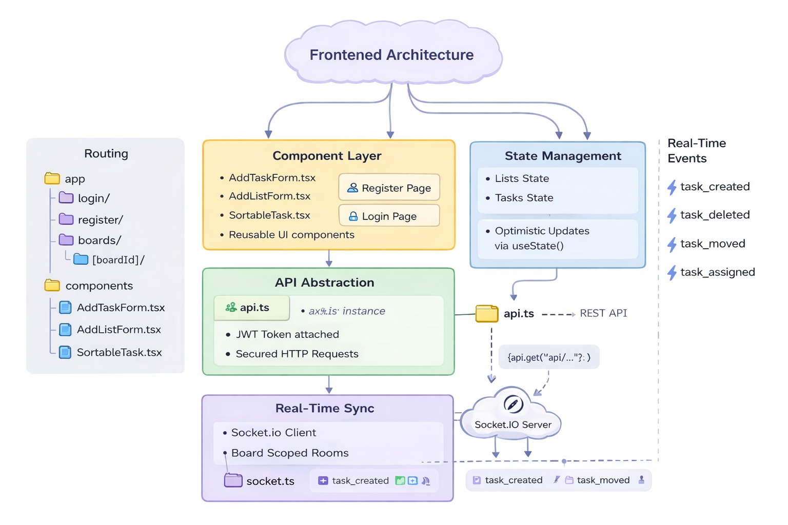
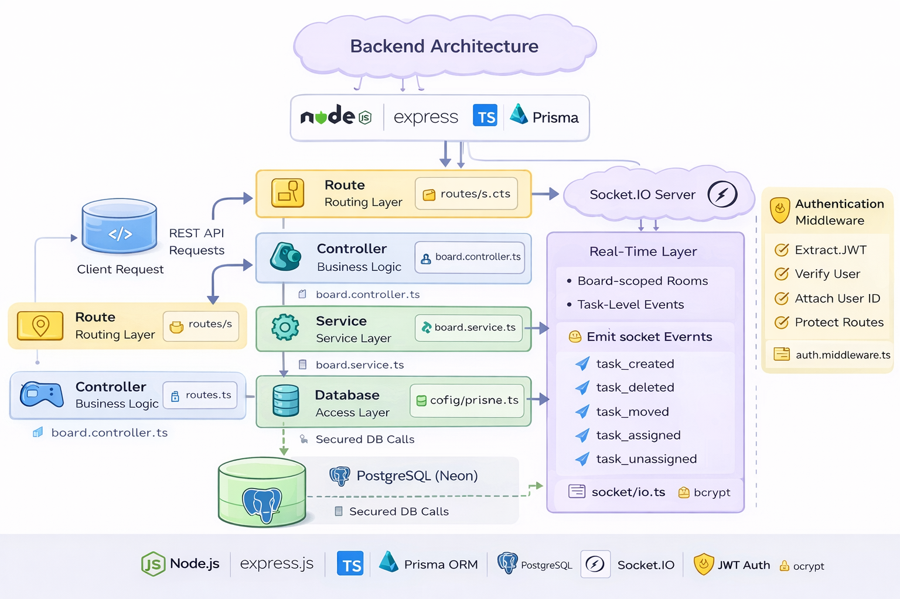

# 🧠 Real-Time Task Collaboration Platform

A full-stack, real-time collaborative task management system inspired by Trello.

---

## 🖥 Frontend Architecture

  

Routing, state management, drag-and-drop logic, and real-time integration built using Next.js App Router.

---

## 🧠 Backend Architecture

  

Layered architecture with controllers, services, Prisma ORM, JWT authentication, and Socket.IO integration.

---

## 📊 Database Schema

  

Relational structure representing Board → List → Task hierarchy with ownership and constraints.

---

## 🚀 Tech Stack

### Frontend
- Next.js (App Router)
- TypeScript
- TailwindCSS
- Axios
- Socket.IO Client
- dnd-kit

### Backend
- Node.js
- Express.js
- TypeScript
- Prisma ORM
- PostgreSQL (Neon)
- Socket.IO
- JWT
- bcrypt
